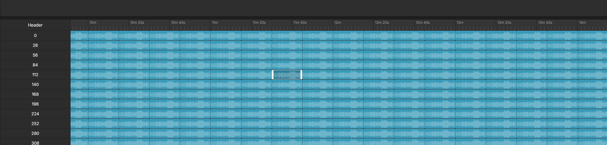
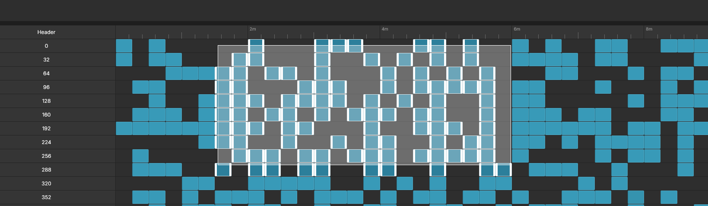

# @paulhalleux/timeline

## Todo
- [ ] Zone selection
  - [x] Show zone selection
  - [x] Select items
  - [ ] Scroll
    - [x] Vertical scroll
    - [ ] Horizontal scroll
  - [x] Position relation to scroll container, should grow with scroll
- [ ] Keyboard selection
- [ ] Zoom origin position
- [ ] Resizable track header
- [ ] Dynamic tracks
- [ ] Dynamic items
- [ ] Dynamic options (can change at runtime)
- [ ] Nowline
- [ ] Playable nowline
- [ ] Feature flags
- [ ] Item fetch
- [ ] Track overlay
- [ ] Define re-compute dependency in features
- [ ] Track grouping
- [ ] Sub-tracks w/ expanded/collapsed
- [ ] Create item instance on demand
- [ ] Allow multi-directional auto-scroll
- ... to be continued

## Done
- [x] Basic timeline with viewport handling
- [x] Track header / view separation
- [x] Item selection / multi-selection
- [x] Virtualization
  - [x] Virtualized tracks
  - [x] Virtualized items
- [x] Basic memoization of track & item instances
  - [x] Track memoization
  - [x] Single item memoization
- [x] Waveform module
- [x] Ruler
  - [x] Sub-ticks
- [x] Timeline overlay
- [x] Handle abort in mount/unmount
- [x] Horizontal scroll with mouse wheel